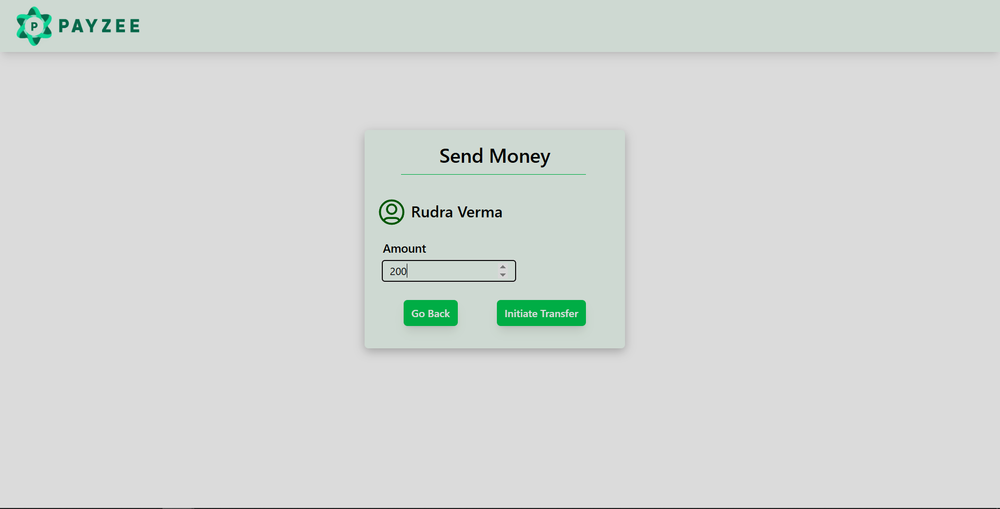
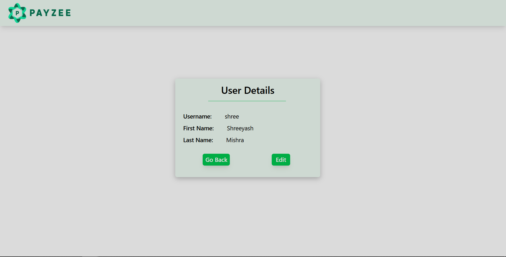

# Money transfer Application

A simple full-stack web application built with the MERN stack (MongoDB, Express.js, React.js, Node.js) that allows users to:
- Sign up and sign in securely

- Send and receive a dummy currency

- View current balance

- Edit and update profile information
- 
## Features
- Authentication: Sign up and log in using JWT-based authentication

- Send/Receive Money: Users get a randomly generated dummy balance in their account which they can transfer and recieve from other users

- Balance Tracking: See your updated balance after every transaction

- Profile Management: Edit profile details such as username, first name, last name, etc.
- 
## Tech Stack

- Frontend: React.js (with Axios)

- Backend: Node.js, Express.js

- Database: MongoDB (Mongoose)

- Authentication: JSON Web Tokens (JWT)
	
## Screenshots

